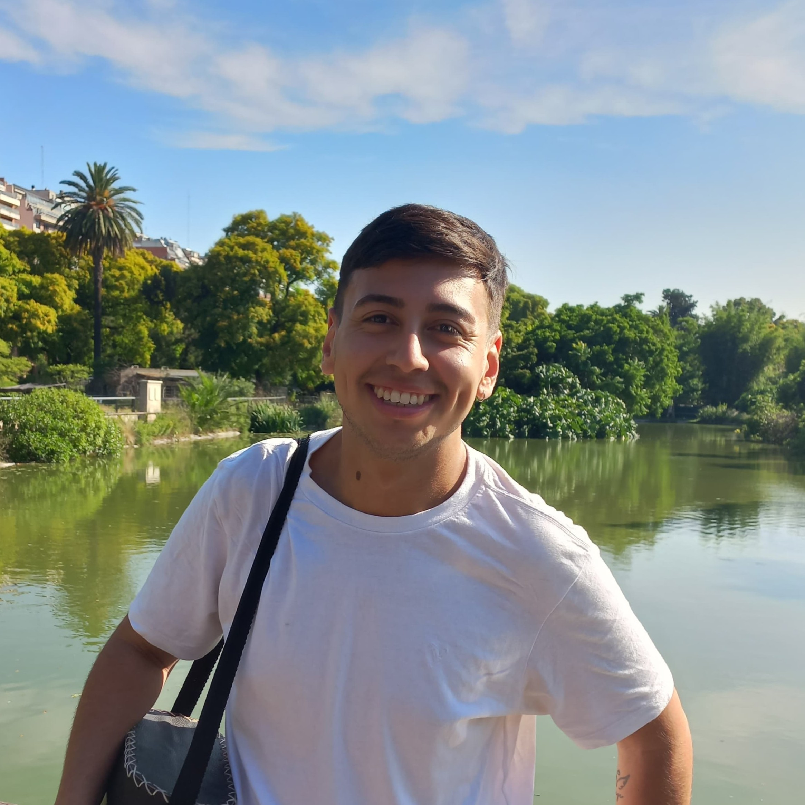

# Ignacio Blanco

Hola, me llamo **Ignacio**, comencé a estudiar la **Tecnicatura Universitaria en Programación** en el año 2023. Me costó adaptame a la vida universitaria, recursé 2 veces Introducción a Lógica y 3 veces Programación Estructurada, pero nunca me rendí.

Comencé a estudiar programación ya que siempre estuce interesado en el mundo de la tecnología, en como se creaban cada pieza de software y en como funcionaba una computadora. Desde que tengo uso de razón tengo una PC, influenciado por el hermano de mi padrino que cuando era niño lo veía trabajar con su notebook escribiendo código.

En la actualidad trabajo como vendedor para Pepsico y a la vez estudio.

Tengo como meta recibirme en 2028 y poder trabajar en IT lo antes posible.

### Datos Personales
- Mi nombre es: Ignacio Alejandro Blanco
- Vivo en San Miguel, Pcia. Buenos Aires.

### Otra Información
- Me gusta jugar al tenis, lo practico desde 2022.
- Tengo una perrita que se llama Milka.
- Me gusta escuchar todo el día música, escucho cualquier género.
- En 2021 comencé a estudiar la Lic. En administración pero en 2022 abandoné, ya que no era lo que quería.
- Mi proximo objetivo es conseguir trabajo como en el mundo IT. 